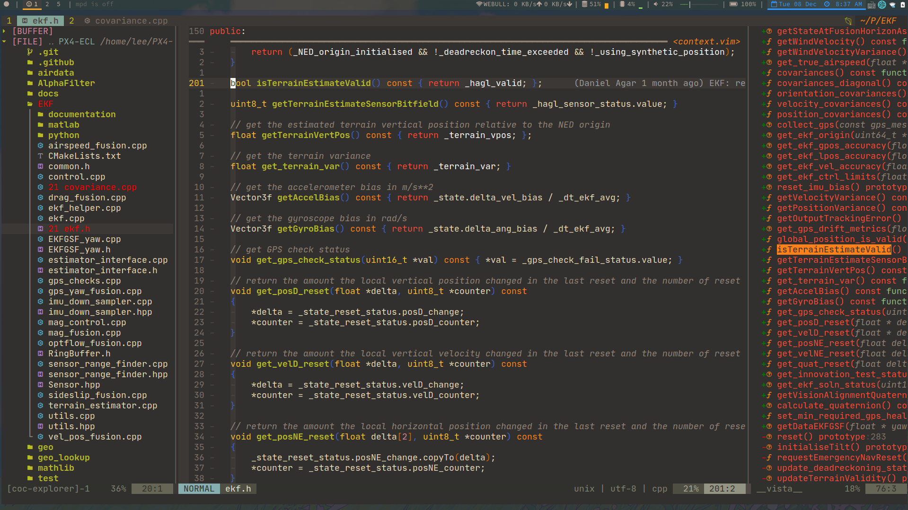

# 🚀🚀 Lee's Neovim Config 

## Inspired by 🌟🌟

* Theniceboy's [Neovim video](https://space.bilibili.com/13081489?from=search&seid=9375318644841322836) and [config files](https://github.com/theniceboy/nvim).

* Amix's  [ Ultimate vimrc](https://github.com/amix/vimrc).

## About This Config

* I began to use neovim about 1 year ago(2019), and now it's my **favorite** 🥰 editor! I keep
learning and tuning neovim in the past one year;  

* Due to my study and work in Robotics 🤖, I usually code in C/C++ as well as Python. So if you 
  want to use (neo)vim as a lightweight IDE for C++ as well as Python, This config is **JUST FOR YOU!** ✌️

* I strongly recommend to use **neovim rather than vim**. But if you have already fallen in love with vim,
and feel guilty to cheat behind her 😉, at least make sure the vim version is above 8.2 to minimize the bugs while using the plugins.

* Take whatever you want, but please **DO NOT** ❌ just clone it without skimming! 

---

---

---

---

## Main Features

* As **LESS remaps** as I can do to keep the original vim keybings;

* Different moduls are well arranged and separated;

* Use [coc.nvim](https://github.com/neoclide/coc.nvim) as the main platform;

* .....

## Config Structure

**NOTE:**

* the file or directory with * means it will be created automatically after installing.

| Files or Directory     | Illstrations                                                                                     |
|------------------------|--------------------------------------------------------------------------------------------------|
| init.vim               | The entrance file of the whole config.                                                           |
| basic.vim              | The basic config of the (neo)vim, includes keybindings and other basic features without plugins. |
| function.vim           | The additional functions that help a lot.                                                        |
| *_machine_specific.vim | The config for different host computer. Python path, etc.                                        |
| coc-settings.json      | The config for coc.nvim platform                                                                 |
| **autolaod/**          | "Vim-plug" plugin manager.                                                                       |
| **plug/**              | The catalog for the different plugins.                                                           |
| **plug_config/**       | The custom settings for the above installed plugins.                                             |
| **Ultisnips/**         | The custom collection of the snippest for coc-snippest.                                          |
| ***plugged/**          | The plugin installing directory.                                                                 |
| ***tmp/**              | The temporary file, like the undo and swap files, etc.                                           |

## Usage

**NOTE:** 
* If you just want to use the *Pure Vim*, don't bother to install the whole config, just use the "basic.vim" instead. Or,
change the vimrc to install the modules you want; And I highly recommend you guys to search the plugs on [github](https://github.com)
to find more information before you are really about to install them.

* 👇👇The following instructions are for the ultimate config version. 

---
- [ ] Before installing: the followering requirments should be satisfied!!!!

| Dependences                                                   | Brief Descriptions                         |
|---------------------------------------------------------------|--------------------------------------------|
| [ Python2 & Python3 ](https://www.python.org/)                | Many plugins requrie.                      |
| [ nodejs          ](https://nodejs.org/en/)                   | coc.nvim platform requires.                |
| [ clangd          ](http://clangd.llvm.org/installation.html) | The language server for C/C++              |
| [ universial-ctags](https://github.com/universal-ctags/ctags) | The requriement for Vista.nvim             |
| [ fzf             ](https://github.com/junegunn/fzf)          | Fuzzy file finder, for nvim.               |
| [ ranger          ](https://github.com/ranger/ranger)         | A vim-like file explorer.                  |
| [ nerd-font       ](https://github.com/ryanoasis/nerd-fonts)  | Fancy fonts to make the nvim more elegent. |

---
- [ ] To fully install this config

* `mkdir ~/.config/`
* `cd ~/.config/`
* `git clone https://github.com/lee-shun/nvim.git`

---

- [ ]   After installing

* **RUN** `:checkhealth` in neovim to findout the further dependences
* **FOLLOW** the advice the neovim gives to you to install the complete dependences.

## LICENSE

MIT

