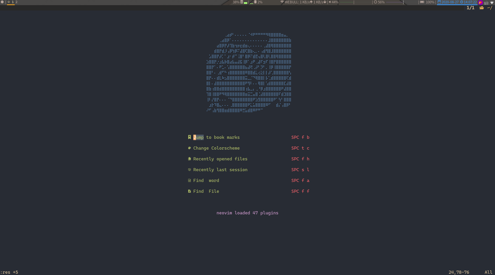
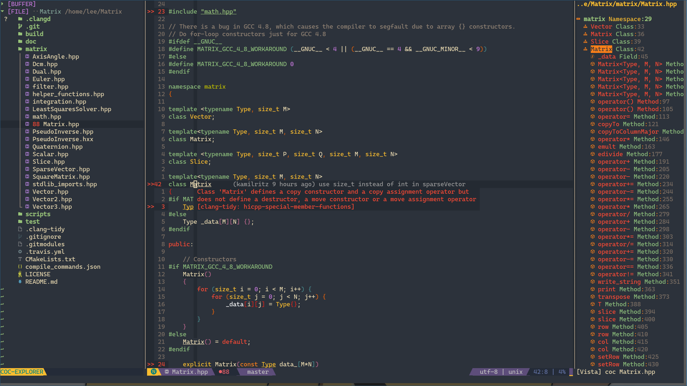

## 
📘📘 My Neovim Config 

#### 
🙏🙏Thanks for theniceboy's [neovim video](https://space.bilibili.com/13081489?from=search&seid=9375318644841322836) and [config files](https://github.com/theniceboy/nvim)!!

#### About This Config
* I began to use neovim about 1 year ago(2019), and now it's my **favourate** editor! I keep
learning and tuning neovim in the past one year;  

* Due to my study and work in Robotics, I usually code in C/C++ as well as Python. So if you 
  want to use (neo)vim as a lightweight IDE for C++ as well as Python, This config is **JUST FOR YOU!**

* Take whatever you want, but please **DO NOT** just clone it without skimming! 
 

####  Main Features
* As **LESS remaps** as I can do to keep the original vim keybings;
* Different moduls are well arranged;
* Use [coc.nvim](https://github.com/neoclide/coc.nvim) as the main platform;
* .....

####  Files Tree

* NOTE: the file or directory with * means it will be created automatically after installing.

| Files or Directory     | Illstrations                                                                                     |
|------------------------|--------------------------------------------------------------------------------------------------|
| init.vim               | The entrance file of the whole config.                                                           |
| basic.vim              | The basic config of the (neo)vim, includes keybindings and other basic features without plugins. |
| *_machine_specific.vim | The config for different host computer. Python path, etc.                                        |
| coc-settings.json      | The config for coc.nvim platform                                                                 |
| **autolaod/**          | "Vim-plug" plugin manager.                                                                       |
| **plug/**              | The catalog for the different plugins.                                                           |
| **plug_config/**       | The custom settings for the above installed plugins.                                             |
| **Ultisnips/**         | The custom collection of the snippest for coc-snippest.                                          |
| ***plugged/**          | The plugin installing directory.                                                                 |
| ***tmp/**              | The temporary file, like the undo and swap files, etc.                                           |

#### Usage
- [ ] before installing: the followering requirments should be satisfied!!!!

* Python
* nodejs
* clangd
* universial-ctags
* fzf
* ranger
* nerdfonts

---
- [ ] to "instal" this config

* `mkdir ~/.config/` 
* `cd ~/.config/` 
* ` git clone https://github.com/lee-shun/nvim.git`

---
- [ ]   after installing
* **RUN** `:checkhealth` in neovim to findout the further dependences

#### LICENSE
MIT

